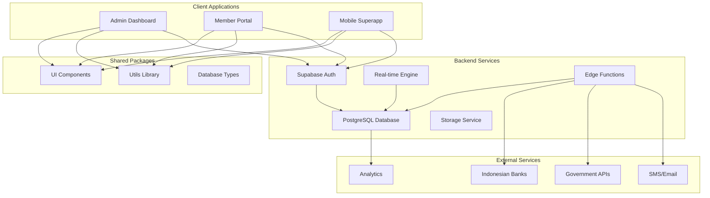
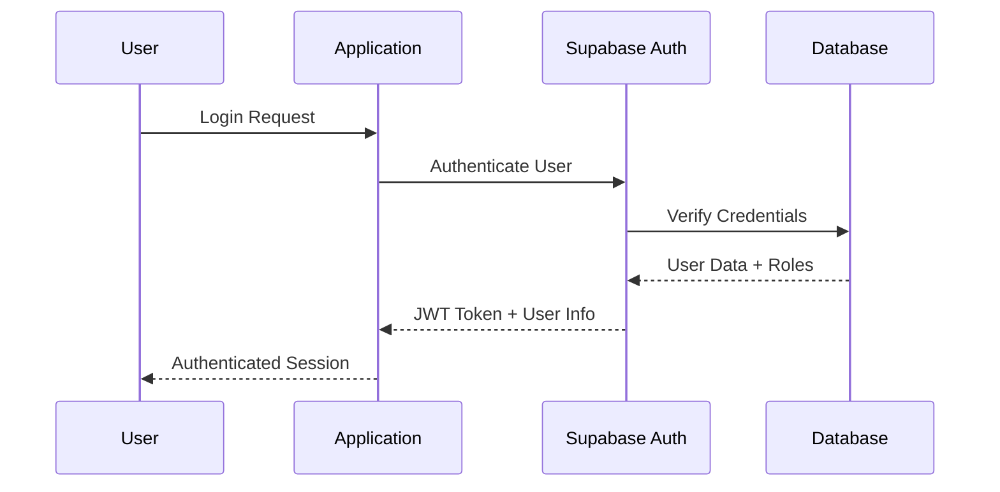
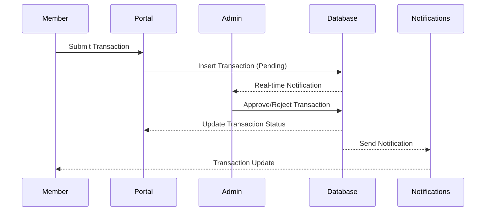
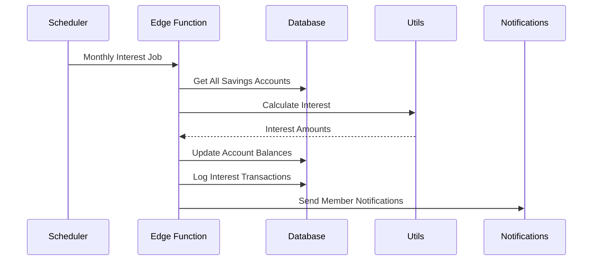

# System Architecture Overview

This document provides a high-level overview of the Koperasi Sinoman platform architecture, design principles, and technical decisions.

## 🏗️ High-Level Architecture



## 🎯 Design Principles

### 1. **Monorepo Architecture**
- **Shared Code** - Common utilities and components across applications
- **Type Safety** - Shared TypeScript types ensure consistency
- **Build Optimization** - Turborepo for intelligent caching and parallel builds
- **Version Management** - Synchronized versioning across packages

### 2. **Microservices Pattern**
- **Application Separation** - Admin, Member, and Mobile apps as separate services
- **Package Isolation** - Independent deployment and scaling
- **Service Communication** - APIs and shared database for communication
- **Fault Isolation** - Failure in one service doesn't affect others

### 3. **Database-First Design**
- **Single Source of Truth** - PostgreSQL as central data store
- **Schema-Driven Development** - Database schema drives TypeScript types
- **Data Integrity** - Database constraints and validation rules
- **Real-time Capabilities** - Built-in real-time subscriptions

### 4. **Security by Design**
- **Row Level Security (RLS)** - Database-level access control
- **Zero Trust Architecture** - No implicit trust between components
- **End-to-End Encryption** - Sensitive data encrypted at rest and in transit
- **Audit Logging** - Comprehensive audit trails for compliance

## 🏢 Application Architecture

### Admin Dashboard
```typescript
// Application Structure
apps/admin/
├── src/app/                 # Next.js App Router
│   ├── (auth)/             # Authentication pages
│   ├── dashboard/          # Main dashboard
│   ├── members/            # Member management
│   ├── savings/            # Savings administration
│   └── settings/           # System configuration
├── components/             # Admin-specific components
└── lib/                    # Admin utilities
```

**Key Features:**
- **Role-Based UI** - Dynamic interface based on user permissions
- **Real-time Updates** - Live member activity and transaction feeds
- **Bulk Operations** - Efficient processing of large member datasets
- **Reporting Dashboard** - Financial analytics and regulatory reports

### Member Portal
```typescript
// Application Structure
apps/member/
├── src/app/                # Next.js App Router
│   ├── (dashboard)/        # Member dashboard
│   ├── savings/            # Personal savings management
│   ├── loans/              # Loan applications and tracking
│   └── profile/            # Profile and KYC management
├── components/             # Member-specific components
└── lib/                    # Member utilities
```

**Key Features:**
- **Personal Dashboard** - Individual member account overview
- **Self-Service** - Profile updates, document uploads, transactions
- **Mobile-Optimized** - Responsive design for mobile devices
- **Indonesian UX** - Localized user experience and language

### Mobile Superapp
```typescript
// Application Structure
apps/superapp/
├── src/app/                # Next.js App Router (PWA)
│   ├── (tabs)/             # Bottom tab navigation
│   ├── qr/                 # QR code scanning and generation
│   ├── offline/            # Offline functionality
│   └── notifications/      # Push notifications
├── components/             # Mobile-optimized components
└── lib/                    # Mobile utilities
```

**Key Features:**
- **Progressive Web App (PWA)** - App-like experience on mobile
- **Offline Support** - Critical features work without internet
- **QR Code Integration** - Digital member cards and payments
- **Push Notifications** - Real-time member updates

## 📦 Package Architecture

### UI Components (`@koperasi-sinoman/ui`)
```typescript
// Shared UI Architecture
packages/ui/
├── components/
│   ├── base/               # Core components (Button, Input)
│   ├── forms/              # Form components with validation
│   ├── layout/             # Layout and navigation components
│   ├── admin/              # Admin-specific components
│   └── mobile/             # Mobile-optimized components
├── hooks/                  # Reusable React hooks
├── utils/                  # UI utilities and helpers
└── themes/                 # Design system and theming
```

**Design System:**
- **Consistent Branding** - Indonesian cooperative visual identity
- **Accessibility** - WCAG 2.1 AA compliance for inclusive design
- **Responsive Design** - Mobile-first approach for all components
- **Theme Support** - Light/dark modes and customizable themes

### Utils Library (`@koperasi-sinoman/utils`)
```typescript
// Utility Architecture
packages/utils/
├── validation/             # Indonesian-specific validation
├── formatting/             # Currency, date, and number formatting
├── currency/               # Indonesian Rupiah utilities
├── qr-code/               # Digital member card QR codes
├── crypto/                # Security and encryption utilities
└── constants/             # Indonesian business constants
```

**Indonesian Features:**
- **NIK Validation** - Indonesian National ID verification
- **Currency Formatting** - Proper Indonesian Rupiah display
- **QR Code Generation** - Secure member identification
- **Business Logic** - Cooperative-specific calculations

### Database Package (`@koperasi-sinoman/database`)
```typescript
// Database Architecture
packages/database/
├── types/                  # TypeScript database types
├── schemas/                # Table definitions and relationships
├── migrations/             # Database schema changes
├── seeds/                  # Sample and test data
└── queries/                # Common database queries
```

**Data Modeling:**
- **Cooperative Structure** - Members, savings, loans, governance
- **Indonesian Compliance** - KYC, regulatory reporting, audit trails
- **Performance Optimization** - Indexes, views, and query optimization
- **Data Integrity** - Constraints, triggers, and validation rules

## 🔄 Data Flow Architecture

### 1. **User Authentication Flow**


### 2. **Member Transaction Flow**


### 3. **Savings Interest Calculation Flow**


## 🚀 Performance Architecture

### Frontend Optimization
- **Server-Side Rendering (SSR)** - Fast initial page loads
- **Static Site Generation (SSG)** - Pre-rendered pages for speed
- **Code Splitting** - Lazy loading of application features
- **Image Optimization** - WebP and responsive images
- **Caching Strategy** - Edge caching and browser caching

### Backend Optimization
- **Connection Pooling** - Efficient database connection management
- **Query Optimization** - Indexed queries and optimized SQL
- **Real-time Subscriptions** - Efficient WebSocket connections
- **Edge Functions** - Global distribution for low latency
- **CDN Integration** - Asset delivery optimization

### Database Performance
- **Indexing Strategy** - Optimized indexes for common queries
- **Partitioning** - Table partitioning for large datasets
- **Read Replicas** - Separate read/write operations
- **Caching Layer** - Redis for frequently accessed data
- **Query Analysis** - Continuous performance monitoring

## 🔐 Security Architecture

### Authentication & Authorization
- **Multi-Factor Authentication (MFA)** - SMS and email verification
- **Role-Based Access Control (RBAC)** - Granular permission system
- **Session Management** - Secure JWT tokens with refresh rotation
- **Password Security** - Bcrypt hashing with salt rounds

### Data Protection
- **Encryption at Rest** - AES-256 encryption for sensitive data
- **Encryption in Transit** - TLS 1.3 for all communications
- **PII Protection** - Separate encrypted storage for personal data
- **Key Management** - Secure key rotation and storage

### Compliance & Auditing
- **Audit Logging** - Complete transaction and access logs
- **Data Retention** - Configurable data retention policies
- **Privacy Controls** - GDPR-style data deletion and portability
- **Regulatory Reporting** - Automated compliance report generation

## 🌍 Indonesian Integration Architecture

### Government Services Integration
```typescript
// Indonesian Government APIs
interface GovernmentIntegration {
  nikValidation: NIKValidationService     // Ministry of Home Affairs
  npwpValidation: NPWPValidationService   // Tax Office (DJPB)
  bankValidation: BankValidationService   // Bank Indonesia
  cooperativeRegistry: CoopRegistryService // Ministry of Cooperatives
}
```

### Banking Integration
```typescript
// Indonesian Banking Integration
interface BankingIntegration {
  accountValidation: BankAccountValidator
  transferProcessing: TransferProcessor
  balanceInquiry: BalanceInquiryService
  paymentGateway: PaymentGatewayService
}
```

### Localization Architecture
- **Multi-Language Support** - Indonesian and regional languages
- **Currency Handling** - Indonesian Rupiah with proper formatting
- **Date/Time Formatting** - Indonesian locale and timezone
- **Cultural Adaptation** - Local business practices and traditions

## 📊 Monitoring & Observability

### Application Monitoring
- **Performance Metrics** - Core Web Vitals and user experience metrics
- **Error Tracking** - Comprehensive error logging and alerting
- **User Analytics** - Member behavior and feature usage analysis
- **Business Metrics** - Cooperative KPIs and financial indicators

### Infrastructure Monitoring
- **System Health** - Server and database performance monitoring
- **Security Monitoring** - Intrusion detection and threat analysis
- **Compliance Monitoring** - Regulatory requirement tracking
- **Cost Optimization** - Resource usage and cost analysis

---

*This architecture overview is maintained by the technical architecture team and updated with each major system change.*