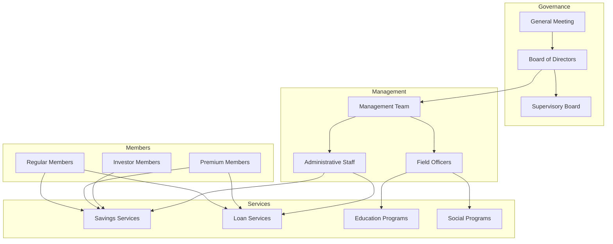

# Business Documentation

Comprehensive business documentation for the Koperasi Sinoman platform, covering functional requirements, user stories, and Indonesian cooperative business processes.

## 📋 Business Documentation

### 📊 Business Requirements
- **[Functional Requirements](./requirements.md)** - Detailed functional specifications
- **[User Stories](./user-stories.md)** - User-centered feature descriptions
- **[Business Rules](./business-rules.md)** - Indonesian cooperative business logic
- **[Workflow Processes](./workflows.md)** - End-to-end business process flows

### 🇮🇩 Indonesian Features
- **[Indonesian Compliance](./indonesian-features.md)** - Regulatory and legal requirements
- **[Cooperative Management](./cooperative-management.md)** - Traditional cooperative processes
- **[Financial Regulations](./financial-regulations.md)** - Indonesian financial compliance
- **[Cultural Considerations](./cultural-considerations.md)** - Local business practices

### 👥 User Documentation
- **[User Guides](./user-guides/)** - Step-by-step user instructions
- **[Admin Manual](./admin-manual.md)** - Administrative user documentation
- **[Member Manual](./member-manual.md)** - Member-facing documentation
- **[Training Materials](./training/)** - User training and onboarding

### 📈 Business Analysis
- **[ROI Analysis](./roi-analysis.md)** - Return on investment calculations
- **[Feature Impact](./feature-impact.md)** - Business impact of platform features
- **[Success Metrics](./success-metrics.md)** - Key performance indicators
- **[Growth Strategy](./growth-strategy.md)** - Platform expansion and scaling

## 🎯 Business Overview

### Mission Statement
To digitally transform Indonesian cooperatives by providing modern, compliant, and user-friendly tools that enhance member experience, streamline operations, and ensure regulatory compliance while preserving cooperative values and principles.

### Target Audience

#### **Primary Users**
1. **Cooperative Members** - Individual members managing their savings and loans
2. **Cooperative Administrators** - Staff managing day-to-day operations
3. **Cooperative Management** - Leadership overseeing strategic decisions
4. **Regulatory Bodies** - Government agencies requiring compliance reporting

#### **Secondary Users**
1. **External Auditors** - Third-party auditing and compliance verification
2. **Technology Partners** - System integrators and service providers
3. **Financial Institutions** - Banks and payment processors
4. **Government Agencies** - Regulatory oversight and data collection

### Value Proposition

#### **For Cooperative Members**
- **Digital Convenience** - 24/7 access to savings and loan services
- **Transparency** - Real-time visibility into account balances and transactions
- **Mobile-First** - Optimized for Indonesian mobile usage patterns
- **Security** - Bank-level security for financial transactions

#### **For Cooperative Administrators**
- **Operational Efficiency** - Automated processes reduce manual work
- **Comprehensive Reporting** - Real-time dashboards and analytics
- **Compliance Management** - Automated regulatory reporting
- **Member Engagement** - Tools to improve member satisfaction

#### **For Cooperative Management**
- **Strategic Insights** - Data-driven decision making capabilities
- **Risk Management** - Comprehensive audit trails and controls
- **Growth Enablement** - Scalable platform for membership expansion
- **Cost Optimization** - Reduced operational costs through automation

## 🏢 Cooperative Business Model

### Traditional Cooperative Structure

### Digital Transformation Benefits

#### **Operational Benefits**
- **Process Automation** - Automated savings calculations and interest distribution
- **Digital Documentation** - Paperless member records and transaction history
- **Real-time Processing** - Instant transaction processing and updates
- **Compliance Automation** - Automated regulatory reporting and audit trails

#### **Member Benefits**
- **Self-Service Portal** - Members can manage accounts independently
- **Mobile Banking** - Mobile-optimized interface for rural areas
- **Digital Identity** - QR code-based member identification
- **Financial Literacy** - Educational content and tools

#### **Management Benefits**
- **Data Analytics** - Member behavior and financial performance insights
- **Risk Management** - Early warning systems for financial risks
- **Strategic Planning** - Data-driven strategic decision making
- **Scalability** - Platform supports rapid membership growth

## 💰 Financial Product Portfolio

### Savings Products

#### **1. Simpanan Pokok (Share Capital)**
- **Purpose** - Initial membership investment
- **Amount** - Fixed amount based on membership type
- **Features** - Non-withdrawable, earns dividend from SHU
- **Compliance** - Required by Indonesian cooperative law

#### **2. Simpanan Wajib (Mandatory Savings)**
- **Purpose** - Regular monthly savings requirement
- **Amount** - Fixed monthly amount based on membership type
- **Features** - Withdrawable with restrictions, earns interest
- **Automation** - Automated monthly deduction option

#### **3. Simpanan Sukarela (Voluntary Savings)**
- **Purpose** - Additional savings for members
- **Amount** - Flexible amounts and frequency
- **Features** - Freely withdrawable, competitive interest rates
- **Benefits** - Higher interest rates for larger balances

#### **4. Simpanan Berjangka (Term Deposits)**
- **Purpose** - Long-term savings with guaranteed returns
- **Terms** - 6 months, 1 year, 2 years, 3 years
- **Features** - Fixed interest rates, penalty for early withdrawal
- **Benefits** - Higher returns for longer commitment

### Loan Products

#### **1. Regular Loans**
- **Purpose** - General personal and business needs
- **Amount** - Based on savings balance and income
- **Terms** - Flexible repayment periods
- **Requirements** - Active membership and savings history

#### **2. Emergency Loans**
- **Purpose** - Urgent financial needs
- **Amount** - Limited amount for quick disbursement
- **Terms** - Short-term repayment
- **Features** - Fast approval process

#### **3. Business Development Loans**
- **Purpose** - Member business expansion
- **Amount** - Larger amounts for business investment
- **Terms** - Longer repayment periods
- **Support** - Business development consultation

## 📊 Key Performance Indicators (KPIs)

### Member Engagement Metrics
- **Active Members** - Members with transactions in last 30 days
- **Digital Adoption** - Percentage using digital channels
- **Member Satisfaction** - NPS scores and feedback ratings
- **Service Usage** - Feature adoption and usage frequency

### Financial Performance Metrics
- **Total Savings** - Aggregate member savings balances
- **Loan Portfolio** - Outstanding loan amounts and performance
- **Interest Income** - Revenue from loan interest
- **Operating Efficiency** - Cost per transaction and member

### Operational Metrics
- **Transaction Volume** - Daily/monthly transaction counts
- **Processing Time** - Average transaction processing time
- **System Uptime** - Platform availability and reliability
- **Support Tickets** - Customer service volume and resolution time

### Compliance Metrics
- **Audit Compliance** - Successful audit completion rate
- **Regulatory Reporting** - Timely submission of required reports
- **Data Quality** - Accuracy and completeness of member data
- **Security Incidents** - Number and severity of security events

## 🎯 Business Objectives

### Short-term Goals (6 months)
- [ ] **Member Onboarding** - Migrate 1,000 existing members to digital platform
- [ ] **Core Features** - Deploy savings and basic loan management
- [ ] **Staff Training** - Train all cooperative staff on new system
- [ ] **Compliance** - Achieve regulatory approval for digital operations

### Medium-term Goals (1 year)
- [ ] **Feature Expansion** - Deploy advanced loan products and analytics
- [ ] **Member Growth** - Acquire 500 new members through digital channels
- [ ] **Integration** - Connect with Indonesian banking systems
- [ ] **Mobile App** - Launch mobile application for members

### Long-term Goals (2-3 years)
- [ ] **Multi-Cooperative** - Expand platform to serve multiple cooperatives
- [ ] **Advanced Analytics** - Implement AI-driven insights and recommendations
- [ ] **Financial Ecosystem** - Integrate with broader Indonesian fintech ecosystem
- [ ] **Regional Expansion** - Support cooperatives across multiple provinces

## 🔄 Change Management

### Implementation Strategy
1. **Pilot Phase** - Limited rollout with select members and staff
2. **Training Phase** - Comprehensive staff and member training
3. **Gradual Rollout** - Phased introduction of features
4. **Full Deployment** - Complete digital transformation
5. **Continuous Improvement** - Ongoing feature development and optimization

### Risk Mitigation
- **Technical Risks** - Comprehensive testing and backup systems
- **User Adoption** - Extensive training and support programs
- **Compliance Risks** - Legal review and regulatory approval
- **Financial Risks** - Phased implementation with clear success metrics

### Success Criteria
- **User Adoption** - 80% of members actively using digital platform
- **Operational Efficiency** - 50% reduction in manual processes
- **Member Satisfaction** - NPS score above 70
- **Financial Performance** - 20% improvement in operational efficiency

---

*Business documentation is maintained by the product team in collaboration with cooperative management and updated quarterly to reflect changing business needs.*