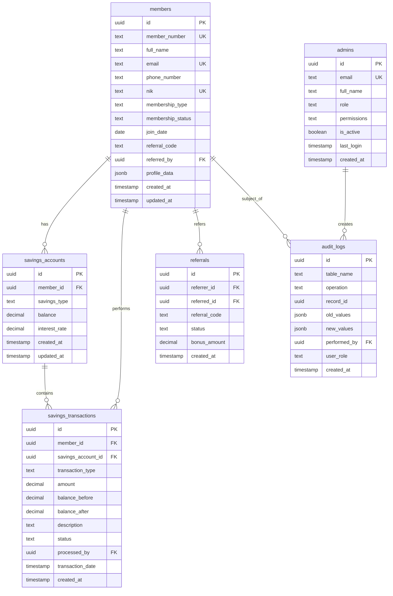

# Database Documentation

Comprehensive documentation for the Koperasi Sinoman PostgreSQL database schema, including table structures, relationships, indexes, and business rules.

## 📊 Database Overview

The Koperasi Sinoman platform uses PostgreSQL with Supabase for a robust, scalable, and real-time database solution optimized for Indonesian cooperative operations.

### Key Features
- **Row Level Security (RLS)** - Database-level access control
- **Real-time Subscriptions** - Live updates for transactions and member activities
- **Audit Logging** - Comprehensive transaction and change tracking
- **Indonesian Compliance** - Built-in validation for Indonesian business rules
- **Performance Optimization** - Indexes and partitioning for large datasets

## 🏗️ Schema Architecture



## 📋 Table Specifications

### Members Table
Primary table for cooperative member information and KYC data.

```sql
CREATE TABLE members (
    id uuid PRIMARY KEY DEFAULT gen_random_uuid(),
    member_number text UNIQUE NOT NULL,
    full_name text NOT NULL,
    email text UNIQUE,
    phone_number text NOT NULL,
    nik text UNIQUE,
    membership_type membership_type_enum NOT NULL DEFAULT 'regular',
    membership_status member_status_enum NOT NULL DEFAULT 'active',
    join_date date NOT NULL DEFAULT CURRENT_DATE,
    referral_code text UNIQUE,
    referred_by uuid REFERENCES members(id),
    profile_data jsonb DEFAULT '{}',
    created_at timestamptz DEFAULT NOW(),
    updated_at timestamptz DEFAULT NOW()
);

-- Indexes for performance
CREATE INDEX idx_members_member_number ON members(member_number);
CREATE INDEX idx_members_email ON members(email);
CREATE INDEX idx_members_nik ON members(nik);
CREATE INDEX idx_members_referral_code ON members(referral_code);
CREATE INDEX idx_members_membership_type ON members(membership_type);
CREATE INDEX idx_members_status ON members(membership_status);
CREATE INDEX idx_members_join_date ON members(join_date);

-- Constraints
ALTER TABLE members ADD CONSTRAINT valid_nik_length
    CHECK (nik IS NULL OR length(nik) = 16);
ALTER TABLE members ADD CONSTRAINT valid_phone_format
    CHECK (phone_number ~ '^\+62[0-9]{9,13}$');
ALTER TABLE members ADD CONSTRAINT valid_email_format
    CHECK (email IS NULL OR email ~ '^[^@]+@[^@]+\.[^@]+$');
```

#### Member Fields Description
- **id** - Primary key (UUID)
- **member_number** - Unique member identification number
- **full_name** - Member's complete legal name
- **email** - Email address (optional, unique if provided)
- **phone_number** - Indonesian phone number format (+62xxx)
- **nik** - Indonesian National ID (16 digits, optional)
- **membership_type** - Type of membership (regular, premium, investor)
- **membership_status** - Current status (active, inactive, suspended)
- **join_date** - Date member joined the cooperative
- **referral_code** - Unique code for member referrals
- **referred_by** - Reference to member who referred this member
- **profile_data** - Additional profile information (JSONB)

### Savings Accounts Table
Manages different types of savings accounts for members.

```sql
CREATE TABLE savings_accounts (
    id uuid PRIMARY KEY DEFAULT gen_random_uuid(),
    member_id uuid NOT NULL REFERENCES members(id) ON DELETE CASCADE,
    savings_type savings_type_enum NOT NULL,
    balance decimal(15,2) NOT NULL DEFAULT 0.00,
    interest_rate decimal(5,4) NOT NULL DEFAULT 0.0000,
    last_interest_date date,
    created_at timestamptz DEFAULT NOW(),
    updated_at timestamptz DEFAULT NOW(),

    CONSTRAINT positive_balance CHECK (balance >= 0),
    CONSTRAINT valid_interest_rate CHECK (interest_rate >= 0 AND interest_rate <= 1),
    UNIQUE(member_id, savings_type)
);

-- Indexes
CREATE INDEX idx_savings_accounts_member_id ON savings_accounts(member_id);
CREATE INDEX idx_savings_accounts_type ON savings_accounts(savings_type);
CREATE INDEX idx_savings_accounts_balance ON savings_accounts(balance);
CREATE INDEX idx_savings_accounts_interest_date ON savings_accounts(last_interest_date);
```

#### Savings Types
- **pokok** - Initial share capital (mandatory, non-withdrawable)
- **wajib** - Mandatory monthly savings
- **sukarela** - Voluntary savings (flexible deposits/withdrawals)
- **berjangka** - Term deposits with fixed duration

### Savings Transactions Table
Records all savings-related transactions with complete audit trail.

```sql
CREATE TABLE savings_transactions (
    id uuid PRIMARY KEY DEFAULT gen_random_uuid(),
    member_id uuid NOT NULL REFERENCES members(id),
    savings_account_id uuid NOT NULL REFERENCES savings_accounts(id),
    transaction_type transaction_type_enum NOT NULL,
    amount decimal(15,2) NOT NULL,
    balance_before decimal(15,2) NOT NULL,
    balance_after decimal(15,2) NOT NULL,
    description text,
    reference_number text UNIQUE,
    status transaction_status_enum NOT NULL DEFAULT 'pending',
    processed_by uuid REFERENCES admins(id),
    transaction_date timestamptz NOT NULL DEFAULT NOW(),
    created_at timestamptz DEFAULT NOW(),

    CONSTRAINT positive_amount CHECK (amount > 0),
    CONSTRAINT valid_balance_calculation CHECK (
        (transaction_type = 'deposit' AND balance_after = balance_before + amount) OR
        (transaction_type = 'withdrawal' AND balance_after = balance_before - amount) OR
        (transaction_type = 'interest' AND balance_after = balance_before + amount) OR
        (transaction_type = 'transfer_in' AND balance_after = balance_before + amount) OR
        (transaction_type = 'transfer_out' AND balance_after = balance_before - amount)
    )
);

-- Indexes for performance and reporting
CREATE INDEX idx_savings_transactions_member_id ON savings_transactions(member_id);
CREATE INDEX idx_savings_transactions_account_id ON savings_transactions(savings_account_id);
CREATE INDEX idx_savings_transactions_type ON savings_transactions(transaction_type);
CREATE INDEX idx_savings_transactions_status ON savings_transactions(status);
CREATE INDEX idx_savings_transactions_date ON savings_transactions(transaction_date);
CREATE INDEX idx_savings_transactions_reference ON savings_transactions(reference_number);

-- Partitioning by transaction date for performance
CREATE TABLE savings_transactions_2024 PARTITION OF savings_transactions
    FOR VALUES FROM ('2024-01-01') TO ('2025-01-01');
```

#### Transaction Types
- **deposit** - Money added to savings account
- **withdrawal** - Money removed from savings account
- **interest** - Interest earned on savings
- **transfer_in** - Money transferred from another account
- **transfer_out** - Money transferred to another account
- **adjustment** - Manual balance adjustment by admin

### Referrals Table
Tracks member referral program participation and bonuses.

```sql
CREATE TABLE referrals (
    id uuid PRIMARY KEY DEFAULT gen_random_uuid(),
    referrer_id uuid NOT NULL REFERENCES members(id),
    referred_id uuid NOT NULL REFERENCES members(id),
    referral_code text NOT NULL,
    status referral_status_enum NOT NULL DEFAULT 'pending',
    bonus_amount decimal(10,2) DEFAULT 0.00,
    bonus_paid_date date,
    created_at timestamptz DEFAULT NOW(),

    CONSTRAINT different_members CHECK (referrer_id != referred_id),
    CONSTRAINT positive_bonus CHECK (bonus_amount >= 0),
    UNIQUE(referred_id) -- Each member can only be referred once
);

-- Indexes
CREATE INDEX idx_referrals_referrer_id ON referrals(referrer_id);
CREATE INDEX idx_referrals_referred_id ON referrals(referred_id);
CREATE INDEX idx_referrals_code ON referrals(referral_code);
CREATE INDEX idx_referrals_status ON referrals(status);
```

### Admins Table
Administrative users with role-based permissions.

```sql
CREATE TABLE admins (
    id uuid PRIMARY KEY DEFAULT gen_random_uuid(),
    email text UNIQUE NOT NULL,
    full_name text NOT NULL,
    role admin_role_enum NOT NULL DEFAULT 'staff',
    permissions jsonb DEFAULT '{}',
    is_active boolean NOT NULL DEFAULT true,
    last_login timestamptz,
    password_hash text NOT NULL,
    created_at timestamptz DEFAULT NOW(),
    updated_at timestamptz DEFAULT NOW()
);

-- Indexes
CREATE INDEX idx_admins_email ON admins(email);
CREATE INDEX idx_admins_role ON admins(role);
CREATE INDEX idx_admins_active ON admins(is_active);
```

#### Admin Roles
- **staff** - Basic administrative functions
- **admin** - Full member and savings management
- **super_admin** - System configuration and user management

### Audit Logs Table
Comprehensive audit trail for compliance and security.

```sql
CREATE TABLE audit_logs (
    id uuid PRIMARY KEY DEFAULT gen_random_uuid(),
    table_name text NOT NULL,
    operation audit_operation_enum NOT NULL,
    record_id uuid NOT NULL,
    old_values jsonb,
    new_values jsonb,
    performed_by uuid,
    user_role text,
    ip_address inet,
    user_agent text,
    created_at timestamptz DEFAULT NOW()
);

-- Indexes for audit queries
CREATE INDEX idx_audit_logs_table_name ON audit_logs(table_name);
CREATE INDEX idx_audit_logs_operation ON audit_logs(operation);
CREATE INDEX idx_audit_logs_record_id ON audit_logs(record_id);
CREATE INDEX idx_audit_logs_performed_by ON audit_logs(performed_by);
CREATE INDEX idx_audit_logs_created_at ON audit_logs(created_at);

-- Partitioning by date for performance
CREATE TABLE audit_logs_2024 PARTITION OF audit_logs
    FOR VALUES FROM ('2024-01-01') TO ('2025-01-01');
```

## 🔧 Database Enums

### Custom Types
```sql
-- Membership types
CREATE TYPE membership_type_enum AS ENUM (
    'regular',    -- Regular member
    'premium',    -- Premium member with additional benefits
    'investor'    -- Investor member with higher limits
);

-- Member status
CREATE TYPE member_status_enum AS ENUM (
    'active',     -- Active member
    'inactive',   -- Inactive member
    'suspended'   -- Suspended member
);

-- Savings account types
CREATE TYPE savings_type_enum AS ENUM (
    'pokok',      -- Share capital
    'wajib',      -- Mandatory savings
    'sukarela',   -- Voluntary savings
    'berjangka'   -- Term deposit
);

-- Transaction types
CREATE TYPE transaction_type_enum AS ENUM (
    'deposit',    -- Deposit money
    'withdrawal', -- Withdraw money
    'interest',   -- Interest payment
    'transfer_in', -- Incoming transfer
    'transfer_out', -- Outgoing transfer
    'adjustment'  -- Manual adjustment
);

-- Transaction status
CREATE TYPE transaction_status_enum AS ENUM (
    'pending',    -- Awaiting approval
    'approved',   -- Approved and processed
    'rejected',   -- Rejected by admin
    'cancelled'   -- Cancelled by member or system
);

-- Referral status
CREATE TYPE referral_status_enum AS ENUM (
    'pending',    -- Referral pending completion
    'completed',  -- Referral completed, bonus eligible
    'paid'        -- Bonus has been paid
);

-- Admin roles
CREATE TYPE admin_role_enum AS ENUM (
    'staff',      -- Basic staff permissions
    'admin',      -- Administrator permissions
    'super_admin' -- Super administrator permissions
);

-- Audit operations
CREATE TYPE audit_operation_enum AS ENUM (
    'INSERT',     -- Record created
    'UPDATE',     -- Record updated
    'DELETE'      -- Record deleted
);
```

## 🔐 Row Level Security (RLS)

### Members Table Policies
```sql
-- Enable RLS
ALTER TABLE members ENABLE ROW LEVEL SECURITY;

-- Members can view their own profile
CREATE POLICY "Members can view own profile" ON members
    FOR SELECT USING (auth.uid() = id);

-- Members can update their own profile (limited fields)
CREATE POLICY "Members can update own profile" ON members
    FOR UPDATE USING (auth.uid() = id);

-- Admins can view all members
CREATE POLICY "Admins can view all members" ON members
    FOR SELECT USING (
        EXISTS (
            SELECT 1 FROM admins
            WHERE id = auth.uid()
            AND is_active = true
            AND role IN ('admin', 'super_admin')
        )
    );

-- Admins can insert new members
CREATE POLICY "Admins can insert members" ON members
    FOR INSERT WITH CHECK (
        EXISTS (
            SELECT 1 FROM admins
            WHERE id = auth.uid()
            AND is_active = true
            AND role IN ('admin', 'super_admin')
        )
    );
```

### Savings Accounts Policies
```sql
ALTER TABLE savings_accounts ENABLE ROW LEVEL SECURITY;

-- Members can view their own savings accounts
CREATE POLICY "Members can view own savings" ON savings_accounts
    FOR SELECT USING (member_id = auth.uid());

-- Admins can view all savings accounts
CREATE POLICY "Admins can view all savings" ON savings_accounts
    FOR SELECT USING (
        EXISTS (
            SELECT 1 FROM admins
            WHERE id = auth.uid()
            AND is_active = true
        )
    );

-- Only admins can modify savings accounts
CREATE POLICY "Admins can modify savings" ON savings_accounts
    FOR ALL USING (
        EXISTS (
            SELECT 1 FROM admins
            WHERE id = auth.uid()
            AND is_active = true
            AND role IN ('admin', 'super_admin')
        )
    );
```

### Savings Transactions Policies
```sql
ALTER TABLE savings_transactions ENABLE ROW LEVEL SECURITY;

-- Members can view their own transactions
CREATE POLICY "Members can view own transactions" ON savings_transactions
    FOR SELECT USING (member_id = auth.uid());

-- Members can insert their own transactions (for deposits)
CREATE POLICY "Members can create deposits" ON savings_transactions
    FOR INSERT WITH CHECK (
        member_id = auth.uid()
        AND transaction_type = 'deposit'
        AND status = 'pending'
    );

-- Admins can view all transactions
CREATE POLICY "Admins can view all transactions" ON savings_transactions
    FOR SELECT USING (
        EXISTS (
            SELECT 1 FROM admins
            WHERE id = auth.uid()
            AND is_active = true
        )
    );

-- Admins can modify transaction status
CREATE POLICY "Admins can process transactions" ON savings_transactions
    FOR UPDATE USING (
        EXISTS (
            SELECT 1 FROM admins
            WHERE id = auth.uid()
            AND is_active = true
        )
    );
```

## 📊 Common Queries

### Member Information
```sql
-- Get member profile with savings summary
SELECT
    m.member_number,
    m.full_name,
    m.membership_type,
    m.membership_status,
    m.join_date,
    COALESCE(sa.total_savings, 0) as total_savings,
    COALESCE(sa.account_count, 0) as savings_accounts
FROM members m
LEFT JOIN (
    SELECT
        member_id,
        SUM(balance) as total_savings,
        COUNT(*) as account_count
    FROM savings_accounts
    GROUP BY member_id
) sa ON m.id = sa.member_id
WHERE m.membership_status = 'active'
ORDER BY m.join_date DESC;
```

### Savings Performance
```sql
-- Monthly savings growth report
SELECT
    DATE_TRUNC('month', st.transaction_date) as month,
    st.transaction_type,
    COUNT(*) as transaction_count,
    SUM(st.amount) as total_amount
FROM savings_transactions st
WHERE st.transaction_date >= CURRENT_DATE - INTERVAL '12 months'
    AND st.status = 'approved'
GROUP BY DATE_TRUNC('month', st.transaction_date), st.transaction_type
ORDER BY month DESC, transaction_type;
```

### Interest Calculation
```sql
-- Calculate monthly interest for all savings accounts
WITH interest_calculation AS (
    SELECT
        sa.id,
        sa.member_id,
        sa.savings_type,
        sa.balance,
        sa.interest_rate,
        sa.balance * (sa.interest_rate / 12) as monthly_interest
    FROM savings_accounts sa
    WHERE sa.savings_type IN ('wajib', 'sukarela', 'berjangka')
        AND sa.balance > 0
        AND (sa.last_interest_date IS NULL
             OR sa.last_interest_date < DATE_TRUNC('month', CURRENT_DATE))
)
SELECT
    ic.*,
    m.member_number,
    m.full_name
FROM interest_calculation ic
JOIN members m ON ic.member_id = m.id
WHERE ic.monthly_interest > 0
ORDER BY ic.monthly_interest DESC;
```

### Referral Report
```sql
-- Referral performance report
SELECT
    ref_member.member_number as referrer_number,
    ref_member.full_name as referrer_name,
    COUNT(r.id) as total_referrals,
    COUNT(CASE WHEN r.status = 'completed' THEN 1 END) as completed_referrals,
    COALESCE(SUM(r.bonus_amount), 0) as total_bonus_earned
FROM members ref_member
LEFT JOIN referrals r ON ref_member.id = r.referrer_id
WHERE ref_member.membership_status = 'active'
GROUP BY ref_member.id, ref_member.member_number, ref_member.full_name
HAVING COUNT(r.id) > 0
ORDER BY total_referrals DESC, total_bonus_earned DESC;
```

## 🔄 Database Functions

### Automatic Interest Calculation
```sql
CREATE OR REPLACE FUNCTION calculate_monthly_interest()
RETURNS TABLE(account_id uuid, interest_amount decimal) AS $$
BEGIN
    RETURN QUERY
    SELECT
        sa.id as account_id,
        (sa.balance * sa.interest_rate / 12)::decimal(15,2) as interest_amount
    FROM savings_accounts sa
    WHERE sa.savings_type IN ('wajib', 'sukarela', 'berjangka')
        AND sa.balance > 0
        AND (sa.last_interest_date IS NULL
             OR sa.last_interest_date < DATE_TRUNC('month', CURRENT_DATE));
END;
$$ LANGUAGE plpgsql;
```

### Member Number Generation
```sql
CREATE OR REPLACE FUNCTION generate_member_number()
RETURNS text AS $$
DECLARE
    new_number text;
    counter integer;
BEGIN
    SELECT COALESCE(MAX(CAST(SUBSTRING(member_number FROM '[0-9]+') AS integer)), 0) + 1
    INTO counter
    FROM members;

    new_number := LPAD(counter::text, 8, '0');

    RETURN new_number;
END;
$$ LANGUAGE plpgsql;
```

### Transaction Processing
```sql
CREATE OR REPLACE FUNCTION process_savings_transaction(
    p_member_id uuid,
    p_savings_account_id uuid,
    p_transaction_type transaction_type_enum,
    p_amount decimal,
    p_description text DEFAULT NULL,
    p_processed_by uuid DEFAULT NULL
)
RETURNS uuid AS $$
DECLARE
    v_current_balance decimal;
    v_new_balance decimal;
    v_transaction_id uuid;
BEGIN
    -- Get current balance with row lock
    SELECT balance INTO v_current_balance
    FROM savings_accounts
    WHERE id = p_savings_account_id
    FOR UPDATE;

    -- Calculate new balance
    IF p_transaction_type IN ('deposit', 'interest', 'transfer_in') THEN
        v_new_balance := v_current_balance + p_amount;
    ELSIF p_transaction_type IN ('withdrawal', 'transfer_out') THEN
        IF v_current_balance < p_amount THEN
            RAISE EXCEPTION 'Insufficient balance: % < %', v_current_balance, p_amount;
        END IF;
        v_new_balance := v_current_balance - p_amount;
    ELSE
        RAISE EXCEPTION 'Invalid transaction type: %', p_transaction_type;
    END IF;

    -- Insert transaction record
    INSERT INTO savings_transactions (
        member_id,
        savings_account_id,
        transaction_type,
        amount,
        balance_before,
        balance_after,
        description,
        status,
        processed_by
    ) VALUES (
        p_member_id,
        p_savings_account_id,
        p_transaction_type,
        p_amount,
        v_current_balance,
        v_new_balance,
        p_description,
        'approved',
        p_processed_by
    ) RETURNING id INTO v_transaction_id;

    -- Update account balance
    UPDATE savings_accounts
    SET balance = v_new_balance,
        updated_at = NOW()
    WHERE id = p_savings_account_id;

    RETURN v_transaction_id;
END;
$$ LANGUAGE plpgsql;
```

## 🔄 Database Triggers

### Audit Logging Trigger
```sql
CREATE OR REPLACE FUNCTION audit_trigger_function()
RETURNS trigger AS $$
BEGIN
    IF TG_OP = 'INSERT' THEN
        INSERT INTO audit_logs (
            table_name,
            operation,
            record_id,
            new_values,
            performed_by,
            user_role
        ) VALUES (
            TG_TABLE_NAME,
            'INSERT',
            NEW.id,
            to_jsonb(NEW),
            auth.uid(),
            current_setting('request.jwt.claims', true)::jsonb->>'role'
        );
        RETURN NEW;
    ELSIF TG_OP = 'UPDATE' THEN
        INSERT INTO audit_logs (
            table_name,
            operation,
            record_id,
            old_values,
            new_values,
            performed_by,
            user_role
        ) VALUES (
            TG_TABLE_NAME,
            'UPDATE',
            NEW.id,
            to_jsonb(OLD),
            to_jsonb(NEW),
            auth.uid(),
            current_setting('request.jwt.claims', true)::jsonb->>'role'
        );
        RETURN NEW;
    ELSIF TG_OP = 'DELETE' THEN
        INSERT INTO audit_logs (
            table_name,
            operation,
            record_id,
            old_values,
            performed_by,
            user_role
        ) VALUES (
            TG_TABLE_NAME,
            'DELETE',
            OLD.id,
            to_jsonb(OLD),
            auth.uid(),
            current_setting('request.jwt.claims', true)::jsonb->>'role'
        );
        RETURN OLD;
    END IF;
    RETURN NULL;
END;
$$ LANGUAGE plpgsql;

-- Apply audit trigger to all tables
CREATE TRIGGER audit_trigger_members
    AFTER INSERT OR UPDATE OR DELETE ON members
    FOR EACH ROW EXECUTE FUNCTION audit_trigger_function();

CREATE TRIGGER audit_trigger_savings_accounts
    AFTER INSERT OR UPDATE OR DELETE ON savings_accounts
    FOR EACH ROW EXECUTE FUNCTION audit_trigger_function();

CREATE TRIGGER audit_trigger_savings_transactions
    AFTER INSERT OR UPDATE OR DELETE ON savings_transactions
    FOR EACH ROW EXECUTE FUNCTION audit_trigger_function();
```

### Updated At Trigger
```sql
CREATE OR REPLACE FUNCTION update_updated_at_column()
RETURNS trigger AS $$
BEGIN
    NEW.updated_at = NOW();
    RETURN NEW;
END;
$$ LANGUAGE plpgsql;

-- Apply to tables with updated_at column
CREATE TRIGGER update_members_updated_at
    BEFORE UPDATE ON members
    FOR EACH ROW EXECUTE FUNCTION update_updated_at_column();

CREATE TRIGGER update_savings_accounts_updated_at
    BEFORE UPDATE ON savings_accounts
    FOR EACH ROW EXECUTE FUNCTION update_updated_at_column();
```

## 📈 Performance Optimization

### Indexing Strategy
```sql
-- Composite indexes for common query patterns
CREATE INDEX idx_savings_transactions_member_date
    ON savings_transactions(member_id, transaction_date);

CREATE INDEX idx_savings_transactions_account_status
    ON savings_transactions(savings_account_id, status);

CREATE INDEX idx_members_type_status
    ON members(membership_type, membership_status);

-- Partial indexes for active records
CREATE INDEX idx_active_members
    ON members(join_date)
    WHERE membership_status = 'active';

CREATE INDEX idx_pending_transactions
    ON savings_transactions(created_at)
    WHERE status = 'pending';
```

### Query Optimization
```sql
-- Materialized view for member summary
CREATE MATERIALIZED VIEW member_summary AS
SELECT
    m.id,
    m.member_number,
    m.full_name,
    m.membership_type,
    m.membership_status,
    m.join_date,
    COALESCE(sa.total_balance, 0) as total_savings,
    COALESCE(sa.account_count, 0) as savings_accounts,
    COALESCE(st.last_transaction_date, m.created_at) as last_activity
FROM members m
LEFT JOIN (
    SELECT
        member_id,
        SUM(balance) as total_balance,
        COUNT(*) as account_count
    FROM savings_accounts
    GROUP BY member_id
) sa ON m.id = sa.member_id
LEFT JOIN (
    SELECT
        member_id,
        MAX(transaction_date) as last_transaction_date
    FROM savings_transactions
    WHERE status = 'approved'
    GROUP BY member_id
) st ON m.id = st.member_id;

-- Refresh the materialized view daily
CREATE OR REPLACE FUNCTION refresh_member_summary()
RETURNS void AS $$
BEGIN
    REFRESH MATERIALIZED VIEW CONCURRENTLY member_summary;
END;
$$ LANGUAGE plpgsql;
```

## 🔒 Data Backup and Recovery

### Backup Strategy
```sql
-- Point-in-time recovery setup
SELECT pg_start_backup('daily_backup');

-- Backup specific tables
pg_dump -t members -t savings_accounts -t savings_transactions \
        --data-only --inserts koperasi_sinoman > backup_$(date +%Y%m%d).sql

-- Backup schema only
pg_dump --schema-only koperasi_sinoman > schema_backup.sql
```

### Data Retention Policies
```sql
-- Archive old audit logs (keep 7 years for compliance)
CREATE TABLE audit_logs_archive (LIKE audit_logs);

-- Move logs older than 2 years to archive
INSERT INTO audit_logs_archive
SELECT * FROM audit_logs
WHERE created_at < CURRENT_DATE - INTERVAL '2 years';

DELETE FROM audit_logs
WHERE created_at < CURRENT_DATE - INTERVAL '2 years';

-- Partition maintenance
DROP TABLE IF EXISTS audit_logs_2022;
```

---

*Database documentation is maintained by the database team and updated with each schema migration. For the most current schema, refer to the migration files in `/supabase/migrations/`.*